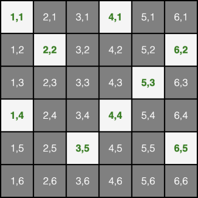

# Reto VI Generación K

Durante siglos, en tiempos de guerra, se ha necesitado encriptar los mensajes para que el enemigo, en caso de interceptarlos, no entendiera de qué se trataba.
Uno de los sistemas que se han utilizado es la codificación de [Rejilla criptográfica](https://es.wikipedia.org/wiki/Rejilla_criptogr%C3%A1fica).

Los generales egipcios de Nekgikis VI, hijo del famoso Nekgikis V, usaban este método y, en una de las cámaras de la tumba del faraón, hemos encontrado un mensaje cifrado con este sistema.

El mensaje que hemos encontrado es: **lróaon. sg sdersoildsu.:.cc kiomamii**

## ¿Podrías descifrar el mensaje usando código JavaScript?

Pistas para resolver el problema:

- Sabemos que usaron una rejilla de 6 x 6 celdas.

- Sabemos que las celdas abiertas están en las posiciones:
  [1,1],[4,1],[2,2],[6,2],[5,3],[1,4],[4,4],[3,5],[6,5] para el grid en posición inicial (0 grados).

- El código JavaScript podría comenzar y terminar así:

  ```
  const sideSize = 6;
  const gridPosBase = [
    [1, 1],
    [4, 1],
    [2, 2],
    [6, 2],
    [5, 3],
    [1, 4],
    [4, 4],
    [3, 5],
    [6, 5],
  ];
  const encriptedMessage = 'lróaon. sg sdersoildsu.:.cc kiomamii';

  /*

  TU CÓDIGO PARA RESOLVERLO

  */

  const decryptedMessage = decrypt(encriptedMessage, gridPosBase);
  console.log(decryptedMessage);
  ```

- Podemos observar que cada vez que giramos la rejilla 90º en el sentido de las agujas del reloj la primera fila (eje x) pasa a ser la sexta columna (eje y), la segunda fila pasa a ser la quinta columna... y la sexta fila pasa a ser la primera columna.

- Una vez tienes todos los pares de coordenadas de todas las posiciones (0º, 90º, 180º y 270º) y ordenados, desencriptar el mensaje consiste en relacionar la posición de cada letra del mensaje con el par de coordenadas:: la primera letra del mensaje descifrado estará en la posición [1,1] la segunda letra del mensaje descifrado estará en la posición [4,1] la tercer letra del mensaje descifrado estará en la posición [2,2]...

- El grid usado es este:



**Más información: [https://kairosds.com/es/generacionk.html](https://kairosds.com/es/generacionk.html)**

---

_Happy coding!_
